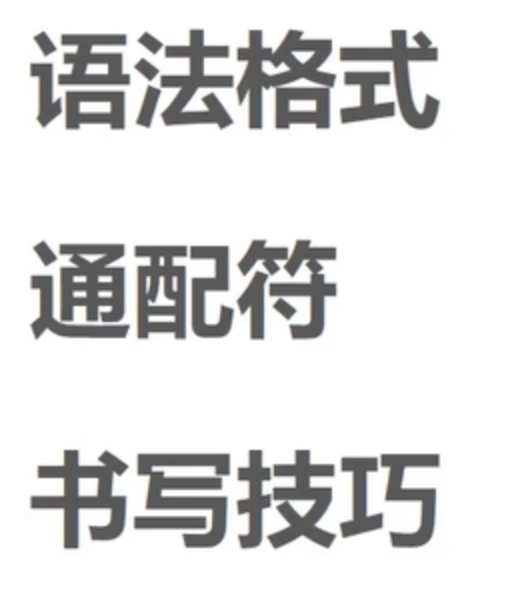
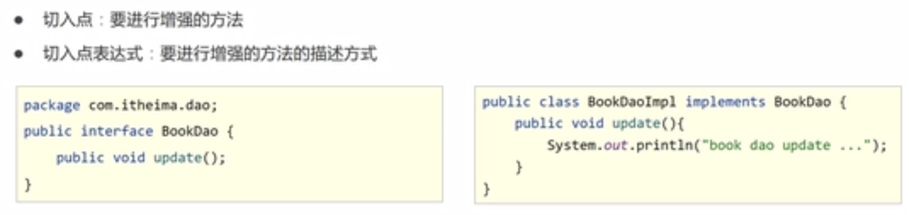
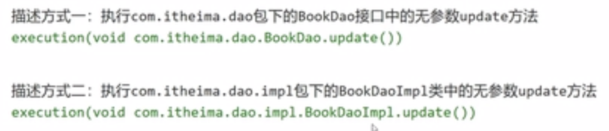
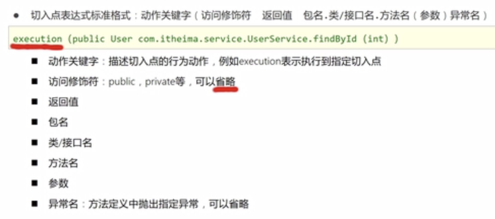
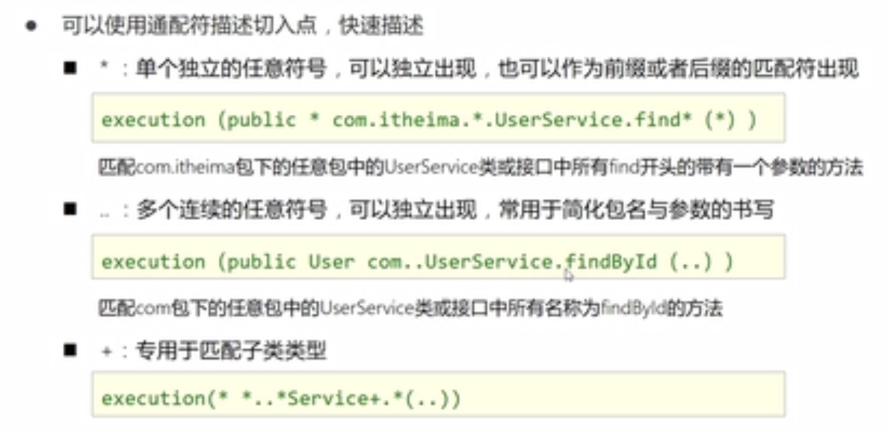
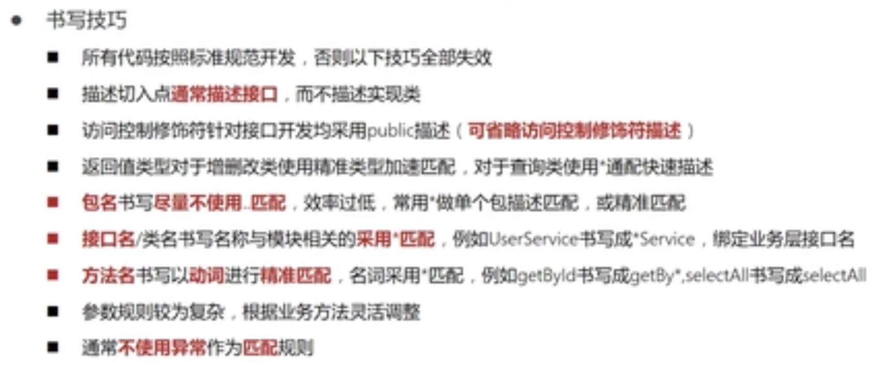
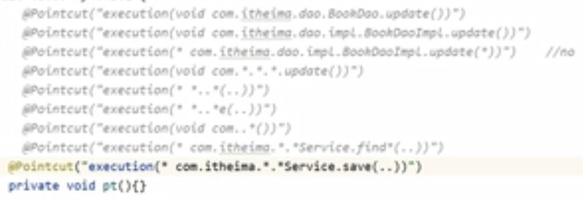

# 32-AOP切入点表达式

# 範例

目前包中有
- com.itheima.dao.BookDao (interface)
- com.itheima.dao.implBookDaoImpl (class)

兩兩皆有 save() 和 update() 方法

- execution( void com.itheima.dao.BookDao.update() )
  - 精準匹配到 interface，可以 work!
- execution( void com.itheima.dao.impl.BookDaoImpl.update() )
  - 精準匹配到 class，也可以 work，但不推薦，因為AOP主要還是希望降耦合，所以還是匹配 interface 為主。
- execution( * com.itheima.dao.impl.BookDaoImpl.update( * ) )
  - 無法匹配，因為會匹配剛好有一個參數的 update 方法
- execution( void com.*.*.*.update() )
  - 匹配到 interface
- execution( * *..*(..) )
  - 匹配到專案所有方法，第一個 * 是回傳值，*.. 是package path + 類名，第三個是方法名稱，最後的 .. 是不限制參數數量和型態 
- execution( * *..*e(..) )
  - 匹配到專案所有名稱以 e 為結尾的方法，因此 save 和 update 都可以
- execution( * com.itheima.*.*Service.save(..) )
  - 類名為 Service 結尾的save方法，參數不限制

